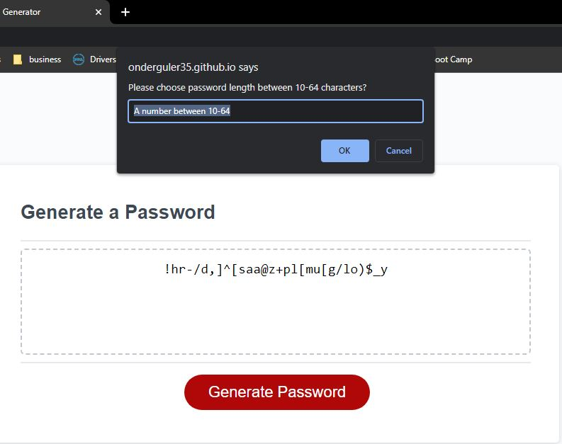

# Safe Password Generator

## Table of Contents
* [Description](#Description)
* [Installation](#Installation)
* [Usage](#Usage)
* [Credits](#Credits)
* [Licence](#Licence)
* [Features](#Features)
* [Contribute](#Contribute)

## Description
This app is a browser application which accepts input from the user through window prompt and confirm commands.
Using the response from the user, it generates a 10-64 digits password which may include special characters, numbers, upper case and lower case letters. 

  

## Installation
You can go to the Github Pages deployement of the app by clicking [here](https://onderguler35.github.io/safePassGen)

## Usage
N/A
## Credits
Thanks to bootcamp teaching team

## Licence
This app is distributed under 

## Features
 

## Contribute
N/A

## Tests
N/A

## Questions
Please click this link to go to [Github repo](https://github.com/onderguler35/safePassGen)
For any questions or comments please [contact me](mailto:onder5@hotmail.com)